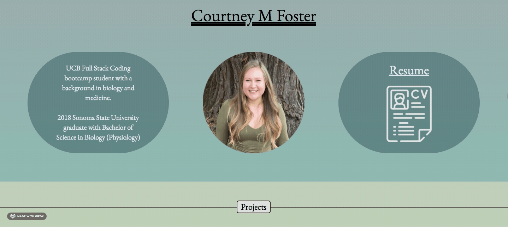
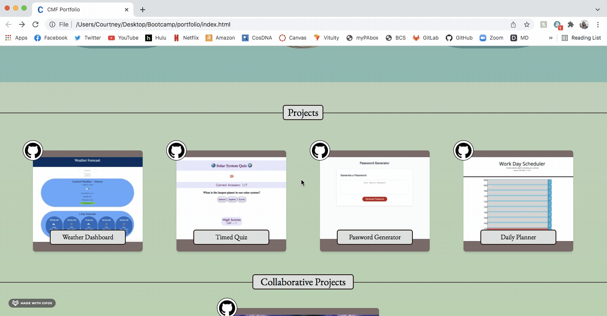
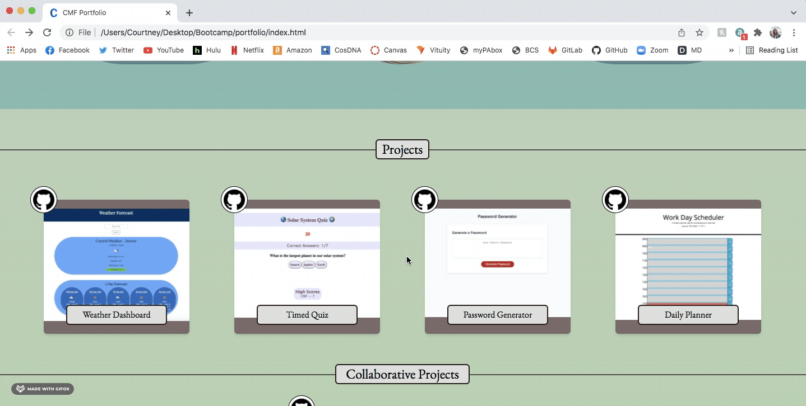
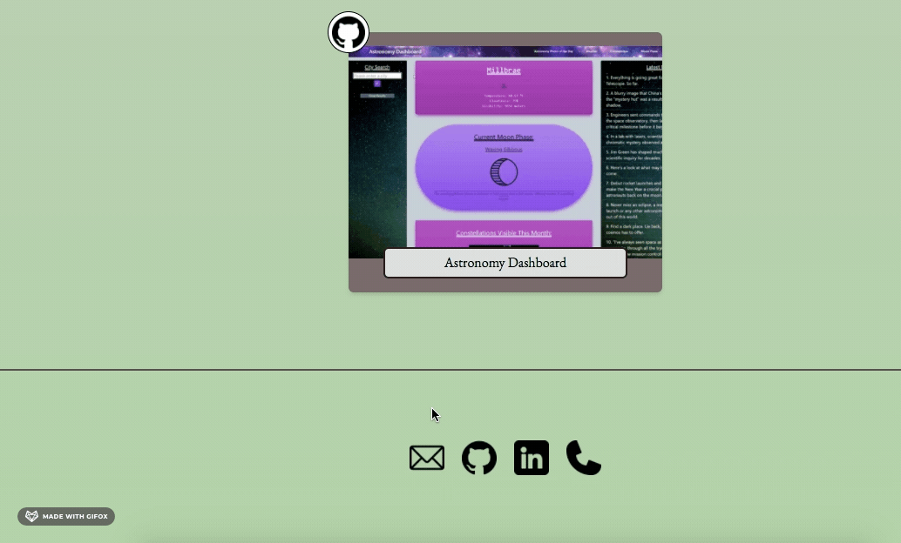
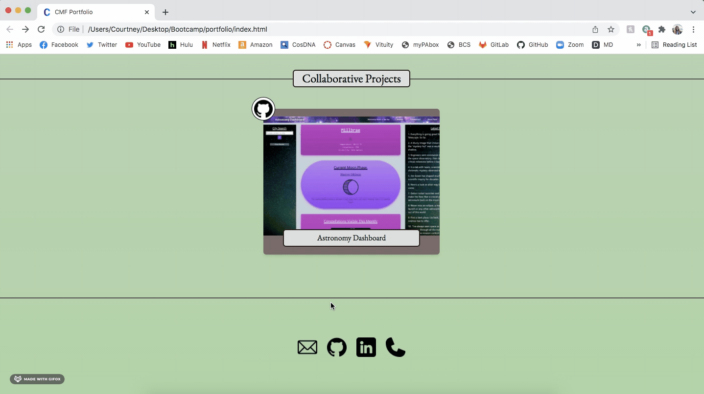
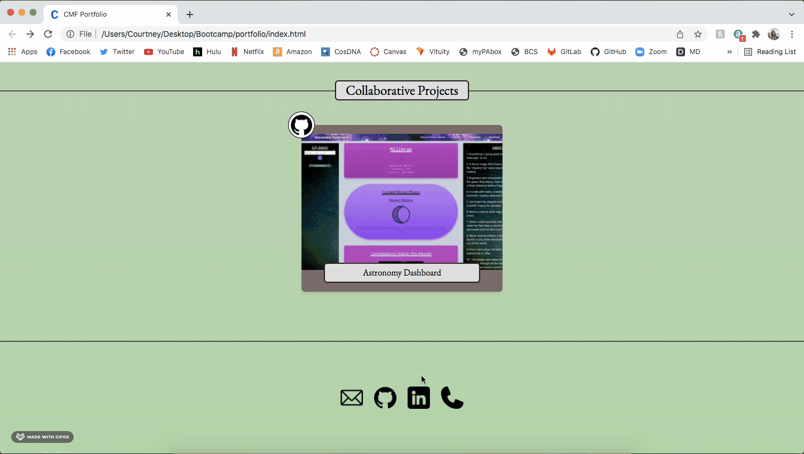
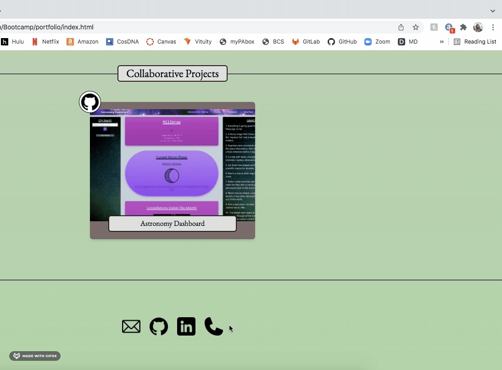
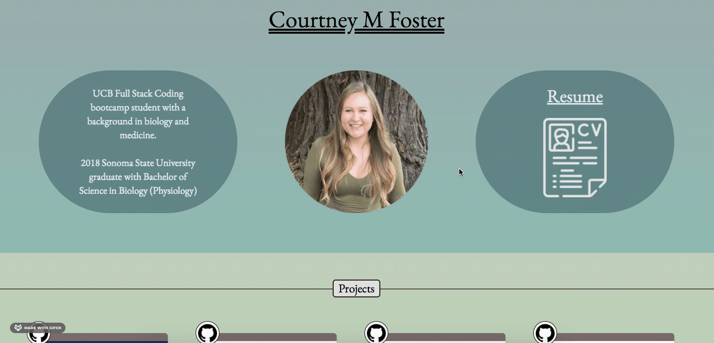

# Personal Portfolio

Responsive portfolio page displaying web development projects, GitHub, LinkedIn, email, phone number, resume, and information about me. 

## Getting Started

Each card displays a screenshot of a deployed web development project. Clicking on the card will open the deployed web page in a new tab. Clicking on the GitHub icon in the corner of each card will take you to that project's GitHub repository. Clicking on the resume icon will open a downloadable pdf of my resume in a new page. At the bottom of the page are icons for contact information. Clicking the email icon will open a new email to be sent to my email address. Clicking the GitHub icon will open my GitHub profile in a new tab. Clicking the LinkedIn icon will open my LinkedIn profile in a new tab. Clicking the phone icon will prompt a call to my Google Voice phone number. 

## Essential Code  

Responsive Breakpoints
  
  
  
Click Card to Deployed Page  
  
  
Click Github Icon to Repository  
  
  
Contact Icons  
  
  
  
  
  

Resume  

## Built With

* [HTML](https://developer.mozilla.org/en-US/docs/Web/HTML)
* [CSS](https://developer.mozilla.org/en-US/docs/Web/CSS)
* [TailwindCSS](https://tailwindcss.com/docs/installation)

## Deployed Link

* [See Live Site](https://cfoster121.github.io/portfolio/)

## Author

**Courtney Foster** 

- [Link to Portfolio Site](https://cfoster121.github.io/portfolio/)
- [Link to Github](https://github.com/cfoster121)
- [Link to LinkedIn](https://www.linkedin.com/in/courtney-foster-0b364575/)

## License

This project is licensed under the MIT License 

## Acknowledgments

* [W3 Schools](https://www.w3schools.com/)
* [MDN Web Docs](https://developer.mozilla.org/en-US/)
* [TailwindCSS Docs](https://tailwindcss.com/docs/installation)
* [Gif Application](https://gifox.io/)
* [Markdown Preview](https://dillinger.io/)

